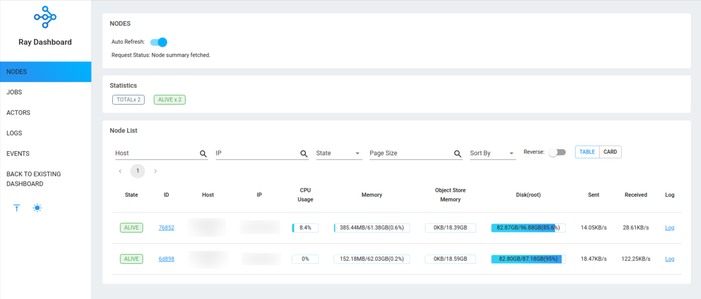

# Ray App

PoC: Ray Application

## Quick Start

First of all, let's configure your development environment.

```bash
# 👇 Python Version
pyenv local 3.8.12

# 👇 Virtual Environment
python -m venv .venv \
  && source .venv/bin/activate \
  && pip install --upgrade pip

# 👇 Dependencies
poetry install
```

Then you have two options, **first** start a cluster on AWS or start a local cluster using Docker.

### First Approach: Ray on AWS

#### 🛫 Up

```bash
ray up -y -v dev-ops/ray-cluster.yaml
```

```bash
# Output Sample
AWS config
IAM Profile: ... [default]
EC2 Key pair (all available node types): ... [default]
VPC Subnets (all available node types): ... [default]
EC2 Security groups (all available node types): ... [default]
EC2 AMI (all available node types): ami-029510cec6d69f121 [dlami]
```

> **🔥 IMPORTANT 🔥**<br>
> We have identified that Ray exposes the 22 port to the internet by default.
> This behavior may not be that cool, because it can represent security risks.
> So, in this case, I've removed this rule manually.

#### 🛬 Down

```bash
ray down -y -v dev-ops/ray-cluster.yaml
``` 

#### 📊 Dashboard

```bash
# Dashboard
# http://localhost:8265
ray dashboard dev-ops/ray-cluster.yaml
```



#### 🔧 Connect via SSH

```bash
ray attach dev-ops/ray-cluster.yaml
```

### Second Approach: Local Ray Cluster using Docker

#### 🛫 Up

```bash
# When the cluster is ready you can access the Ray Dashboard at "http://localhost:8265".
cd dev-ops/my-cluster && docker-compose up -d
```

#### 🛬 Down

```bash
cd dev-ops/my-cluster && docker-compose down
``` 

---

## Links

- [Ray: Quick Start + Demo](https://docs.ray.io/en/latest/cluster/quickstart.html)
- [Ray: Cluster Configuration](https://docs.ray.io/en/latest/cluster/config.html#cluster-config)

